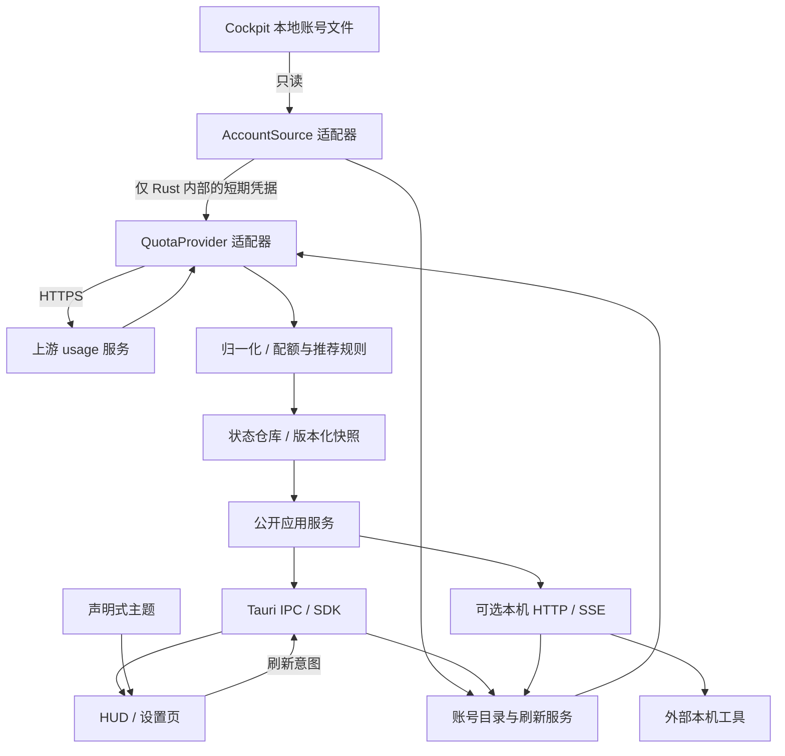

# 架构设计

状态：V1 架构设计基线，2026-10-05。v0.1.0 已实现桌面核心与 IPC；本文还包含后续模块，已交付范围和差异以 [当前实现](IMPLEMENTATION.md) 为准。公开接口见 [API](API.md)，可用性规则见 [DOMAIN](DOMAIN.md)。

## 1. 技术与模块边界

采用 Tauri 2、Rust、React + TypeScript + Vite。Node.js 只参与开发构建，不随应用作为后台进程运行。Windows 使用系统 WebView2，HUD 与设置页为独立窗口，共享同一个 Rust 服务状态。设置窗口按需创建；关闭 HUD 仍保留托盘，退出才停止服务。



| 层 | 职责 | 不承担 |
| --- | --- | --- |
| `domain` | 配额模型、数据可信度、推荐与排序，纯函数可测 | 文件、HTTP、Tauri、主题样式 |
| `application` | 账号选择、刷新任务、快照事务、配置、事件 | 上游 JSON 细节与 UI 格式化 |
| `adapters/cockpit` | 目录发现、索引和单账号只读解析、格式版本检测 | 登录、迁移目录、写回账号 |
| `adapters/codex_usage` | 定向 HTTP 请求、响应解析、字段归一化 | 账号持久化、token 刷新、推荐规则 |
| `transport` | IPC / HTTP 参数验证、权限、统一 DTO 与错误 | 直接操作凭据、另写一套配额逻辑 |
| `presentation` | 组件、倒计时、主题渲染、交互 | 持有 access token、推断账号已恢复 |

先使用单个 Rust crate 内的模块边界；确需独立发布时再拆 workspace crate。通过 Rust trait 注入 `AccountSource`（只读列举和凭据读取）、`QuotaProvider`（查询与归一化）、Clock 和 HTTP client，以便离线测试。不承诺动态库 ABI。

## 2. 单一数据流

1. 配置服务确定 Cockpit 根目录和显示账号集合，建立 `sourceGeneration`。
2. 读取索引得到元数据；选择账号后才读取查询字段。对外使用 HUD 生成的随机稳定 ID，内部映射源 ID / 工作区，不以邮箱或短名当主键。
3. 调度器取得该账号的新凭据快照，调用查询适配器。凭据类型不实现公开序列化，日志不输出其 Debug 内容。
4. 解析器输出领域模型：真实时长、明确缺失状态、原始精度百分比和限制标记；整个 HTTP JSON 不进入公共 DTO。
5. 状态仓库以单次事务更新账号结果、推荐、任务状态与 `revision`，随后发出变更通知。
6. HUD、托盘和外部客户端读取同一状态；倒计时按绝对时间计算，不引发每秒网络请求。

结果提交必须匹配 source/config generation 与账号请求序号。数据源切换、账号取消选择或已删除时，取消关联工作并丢弃晚到结果。账号名称变化不改变 ID；不同工作区不能仅因邮箱相同而合并。

## 3. 只读文件兼容

发现顺序：HUD 中显式选择的路径 → HUD 进程可见的 `COCKPIT_TOOLS_DATA_DIR` → 已知默认与历史路径。环境变量并不保证与另一个已运行进程一致。找到多个独立数据源时在设置中选择，不合并；同一目录的联接别名按最终文件身份去重。已知路径与格式以 [固定上游基线](UPSTREAM.md) 为准。

支持分成两个独立解析器：历史明文 JSON、当前加密 envelope。后者设计为只读已有 key 与详情后在 Rust 内存解密；不能调用可能建 key、重加密或迁移的上游通用读取入口。**当前仅核对公开源码，两个解析器都未在本项目验证。** 缺 key、未知加密版本、解密失败和不支持的账号类型分别返回错误，不退回猜测解析，也不要求用户关闭 Cockpit 加密。

规范化所选根目录，只读取已知索引、固定 key 和合法账号 ID 对应详情文件；拒绝路径穿越及指向根目录外的单账号/key 链接。允许所选根目录本身是 Cockpit 兼容联接，但不创建目录、联接或迁移数据，不遍历整个用户目录。

文件可能在写入中。详情最大 2 MiB、索引最大 8 MiB；超限报错。对短暂锁定或半写入 JSON 作最多 2 次短重读（100 / 300ms），仍失败保留上次元数据并标记异常，不修复源文件。读前后校验元信息；加密格式读取 key 与详情须作一致性复核，认证标签失败只能重读一次一致快照，不能重新建 key。跨文件没有事务保证，最终还需检查账号 ID / 工作区一致性。

`refresh_token`、密码、私钥等字段即使存在，也不纳入 HUD 的凭据模型或持久化。原始读入/解密缓冲可能暂时含有这些字节，应缩短生命周期、尽可能清理内存，禁止保存原文和日志。已删除账号只取消显示绑定，不写回或重建源文件。

## 4. 刷新调度

| 策略 | V1 默认 |
| --- | --- |
| 自动刷新 | 300 秒；范围 60–1800 秒，可暂停 |
| 并发 / 去重 | 全局最多 2 个 HTTP 请求；每账号最多 1 个在途请求 |
| 手动防抖 | 2 秒；每账号最短请求间隔 15 秒 |
| 超时与大小 | 连接 5 秒、总请求 15 秒、响应体最大 1 MiB |
| 自动抖动 | ±10%，不可提前越过服务端退避截止时间 |
| 临时错误退避 | 每账号 30、60、120…秒，最高 30 分钟 |
| 新鲜度 | 成功后 `max(2 × 自动刷新间隔, 120秒)`；默认 10 分钟，暂停不冻结时间 |

启动、手动、自动、唤醒、凭据变化和重置到点都只提交刷新意图。相同目标返回已有任务；部分重合的批次任务共享账号子任务，未覆盖账号另排队，不触发重复 HTTP。任务逐账号交付结果，允许部分成功。失败重试进入后续调度，不无限挂住当前任务。

手动刷新跳过通常缓存，但不绕过并发、最短间隔、退避或 `Retry-After`。429 解析秒数与 HTTP-date；有效值即便大于 30 分钟也遵守，缺失时用退避，公开接口返回 `retryAt`。HTTP 401 后只读重取一次凭据，仅在 access token 已变化时额外请求一次；仍失败则 `AUTH_EXPIRED`，不调用 OAuth 刷新。403 与网络错误不能一律当作 token 过期。

文件监听合并 500ms 后重扫，只对凭据变化的已选账号提交刷新；定时刷新仍重读。睡眠后不补跑积累任务，唤醒合并一次；关闭 HUD 不停止调度。

任一适用基础窗口到重置时间后，账号改为“等待更新”，按账号与 reset 时间只提交一次核实刷新。同一旧 reset 不反复排队；失败走退避。时间跳变与唤醒时重算可信度，间隔/退避使用单调时钟，协议时间为 UTC。

## 5. 公开模型与错误

配额使用窗口数组，保留基础窗口与其他功能窗口区别。`primary` 不必然等于 5h，`secondary` 不必然等于 7d。缺失、明确不适用、无限额度、0% 剩余不可互换。

`lastAttemptAt`、`lastSuccessAt`、`freshness` 分开。失败可以显示上次成功值，但附错误/过期标记并停止肯定推荐。Cockpit 缓存也不能伪装成刚完成的网络查询；V1 默认只使用 HUD 直接查询结果参与推荐。[领域规则](DOMAIN.md) 是唯一算法规范，[类型草案](../contracts/hud-api.ts) 定义公开字段。

错误与诊断统一脱敏：禁止返回请求头、源 JSON、原始 HTTP body、完整邮箱、绝对凭据路径。日志按结构化白名单生成，不能只依赖事后字符串替换。

## 6. Tauri 权限与窗口

| 调用方 | 允许 | 不开放 |
| --- | --- | --- |
| HUD | 读快照、请求刷新、显示/隐藏、打开设置 | 源目录修改、主题导入、凭据或通用文件访问 |
| 设置页 | HUD 权限、偏好、受控目录选择、主题导入、接口授权管理 | 任意 shell、任意网络请求、凭据导出 |
| 主题数据 | 校验后的视觉参数 | IPC、脚本、远程资源 |
| 本机 API | 按授权读取选中账号快照及执行指定动作 | 自行提升权限、改源目录、导入文件、退出应用 |

显式列出 capability 文件、窗口标签与允许命令，命令处理器再校验调用方。**仅创建 capability 文件不足以限制自定义命令**：默认注册的应用命令可被所有应用窗口使用，应通过 `AppManifest::commands` 等接入权限系统，并测试低权限窗口被拒绝。[Tauri Capabilities](https://v2.tauri.app/security/capabilities/)

生产环境禁远程页面导航和远程 IPC origin，不开放通用 fs/http/shell 插件。CSP 只允许内置资源与必要 IPC 来源；不因主题放开 `eval`、远程字体或外链 CSS。受控主题变量渲染也要验证 CSP 兼容性。

HUD 无边框、置顶可选，逻辑像素位置随 DPI / 显示器断开校正；透明效果不能牺牲可读性。鼠标穿透默认关闭，启用前保留托盘与可用快捷键恢复入口。悬浮详情也支持键盘聚焦。

## 7. 本地状态与生命周期

使用 HUD 自己的 Tauri app config/data/log 目录：

| 内容 | 策略 |
| --- | --- |
| 设置、账号 ID 映射、别名、排序 | 版本化 JSON，临时文件 + 原子替换；写失败不发布成功事件 |
| 配额快照 | V1 内存保存；重启先 unknown 再刷新；历史留待后续 |
| 主题 | 校验后原子保存到 themes 目录，可恢复内置主题 |
| 本机 API 授权 | 独立随机 token，只存校验摘要，创建时显示一次，可撤销 |
| 日志 | 脱敏、轮转上限 5 × 1 MiB，导出需用户触发 |

设置有 `configVersion` 和 `settingsRevision`；迁移只操作 HUD 文件并保留可恢复副本，未知较新版本拒绝写入。单实例避免重复刷新与配置竞争。退出停止调度、监听和本机服务，再作有时限的清理。

## 8. 建议实现目录

这是未来实现目录；当前仅文档、contracts、schemas、examples 已交付。

```text
Chatgpt-HUD/
├─ docs/
├─ contracts/hud-api.ts        # 当前草案；实现后由 Rust DTO 生成
├─ schemas/theme.schema.json
├─ examples/themes/
├─ src/                       # React / TypeScript
│  ├─ api/                    # 唯一 SDK 与事件同步入口
│  ├─ hud/
│  ├─ settings/
│  └─ themes/                 # 宿主渲染器
├─ src-tauri/
│  ├─ capabilities/           # hud / settings 分开
│  ├─ permissions/
│  ├─ src/
│  │  ├─ domain/
│  │  ├─ application/
│  │  ├─ adapters/{cockpit,codex_usage}/
│  │  ├─ transport/{ipc,http}/
│  │  ├─ config/
│  │  └─ lib.rs
│  └─ tauri.conf.json
└─ tests/fixtures/            # 合成数据，不放真实账号副本
```

Provider 扩展 V1 指编译进 Rust 的可信适配器，带固定 ID、版本、网络目标白名单与兼容测试。新增提供方通过 capabilities 协商，不改变基础公开模型；不动态加载未知二进制或远程解析脚本。

## 9. 发布约束

Windows 10/11、x64 优先。安装包检查 WebView2 Runtime，便携包同样需要它，不宣称完全无依赖。[Tauri Windows Installer](https://v2.tauri.app/distribute/windows-installer/)

依赖锁文件进入版本管理，适配器更新随应用一起构建验证。自动更新若启用，应验证发布包签名，不运行时拉取上游代码。[实施与验收](ROADMAP.md) 给出阶段和验收要求。
